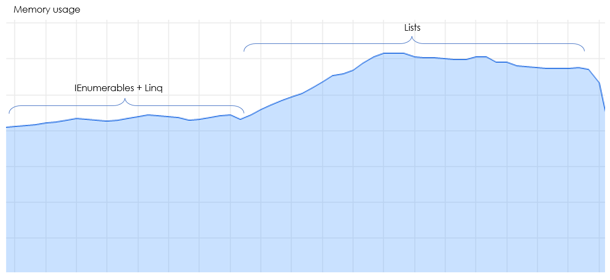

# LinqAnotherPoc

This project is a proof of concept for demonstrating the capabilities of LINQ in C#.

## Getting Started

### Prerequisites

- .NET SDK 6.0 or later
- Visual Studio 2022 or later / Visual Studio Code

## Results
Memory usages increases a lot when using lists.
Creating lists beforehand takes a lot of  time, that's why the number of lists (*finalList*) created using IEnumerable is huge in comparisson to when wee use List.

### Metrics
**First three IEnumerable runs:**
    Size of finalList: 333390
    Used memory: 1032MB
    Elapsed time: 00:00:05.0063396

    Size of finalList: 348078
    Used memory: 1078MB
    Elapsed time: 00:00:05.0000413

    Size of finalList: 348666
    Used memory: 1080MB
    Elapsed time: 00:00:05.0012438

**First three List runs:**
    Size of finalList: 3
    Used memory: 13430MB
    Elapsed time: 00:00:14.1761166
    
    Size of finalList: 4
    Used memory: 9362MB
    Elapsed time: 00:00:06.9729977
    
    Size of finalList: 3
    Used memory: 7021MB
    Elapsed time: 00:00:06.3790724

### Memory Usage

## Contributing

Contributions are welcome! Please fork the repository and create a pull request.

## License

This project is licensed under the BSD License. For more details, see the [LICENSE](LICENSE) file.

